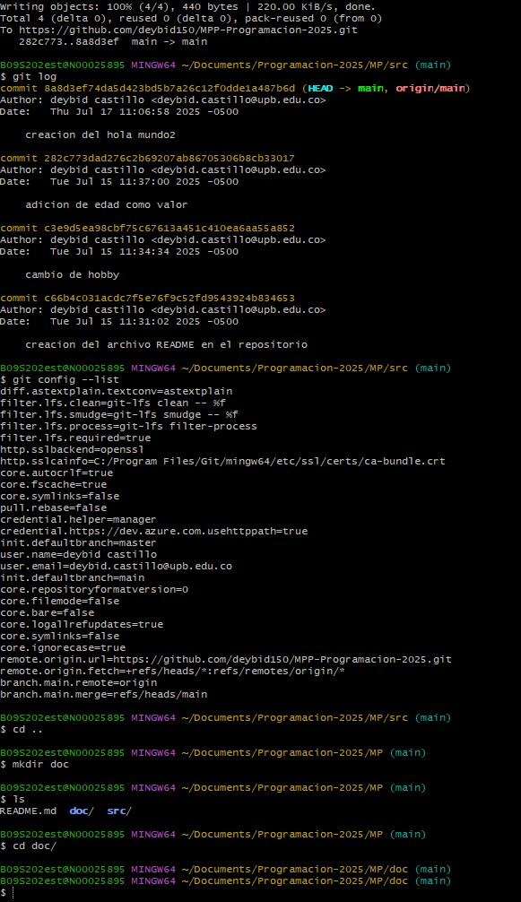

**pasos para crear un repositorio y enlazarlo a la nube**

1. **primer paso** entrar con tu usario y correo usando el comando "git config --global user.name" y "git config --global user.mail" para asegurarnos que trabajamos con las credenciales propias

2. **segundo paso** crear cuenta en github 

3. **tercer paso** se le da a crear nuevo repositorio en la pagina web, automaticamente se creara un enlace propio para el repo y se utilizan los comandos ahi listados para preparar el repositorio local como por ejemplo el git remote and origin seguido del enlace para para efectuar la comunicacion (esto no pasa las carpetas ni archivos)

4. **cuarto paso** se usa el comando git push -u para enviar todos los archivos y carpetas en el repositorio

5. **quinto paso** se usa git log para verificar que el ultimo commit tenga la banderilla de origin lo que verfica que todo se subio correctamente

